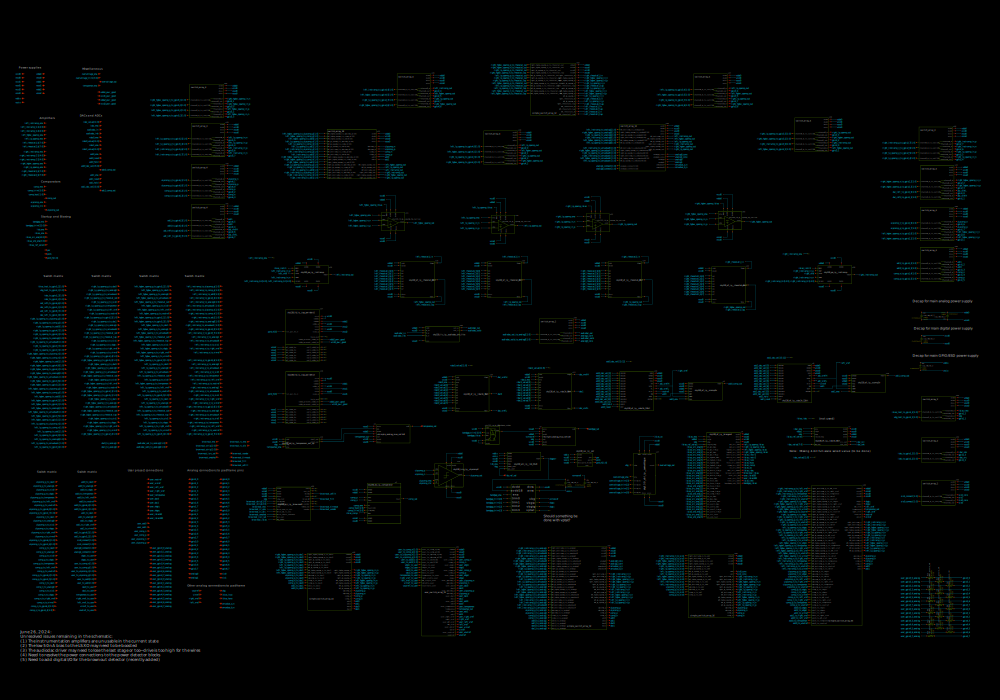
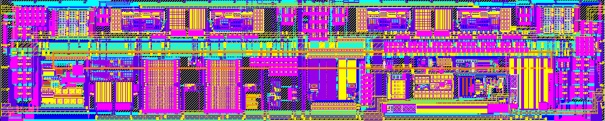

# frigate_analog

- Description: Frigate chip analog signal processing components
- PDK: sky130A

## Authorship

- Designer: Tim Edwards
- Company: Efabless
- Created: November 24, 2024
- License: Apache 2.0
- Last modified: None

## Pins

- vddio
  + Description: Positive ESD power supply
  + Type: power
  + Direction: inout
  + Vmin: 1.62
  + Vmax: 5.5
- vssio
  + Description: ESD ground
  + Type: ground
  + Direction: inout
- vdda0
  + Description: Positive analog power supply
  + Type: power
  + Direction: inout
  + Vmin: 3.3
  + Vmax: 5.0
- vssa0
  + Description: analog ground
  + Type: ground
  + Direction: inout
- vccd0
  + Description: Positive digital power supply
  + Type: power
  + Direction: inout
  + Vmin: 1.62
  + Vmax: 1.98
- vssd0
  + Description: Digital ground
  + Type: ground
  + Direction: inout

## Default Conditions

- vddio
  + Description: ESD power supply voltage
  + Display: vddio
  + Unit: V
  + Typical: 3.3
- vdda0
  + Description: Analog power supply voltage
  + Display: avdd
  + Unit: V
  + Typical: 3.3
- vccd0
  + Description: Digital power supply voltage
  + Display: vccd
  + Unit: V
  + Typical: 1.8
- corner
  + Description: Process corner
  + Display: Corner
  + Typical: tt
- temperature
  + Description: Ambient temperature
  + Display: Temp
  + Unit: °C
  + Typical: 27

## Symbol

## Schematic

## Layout

